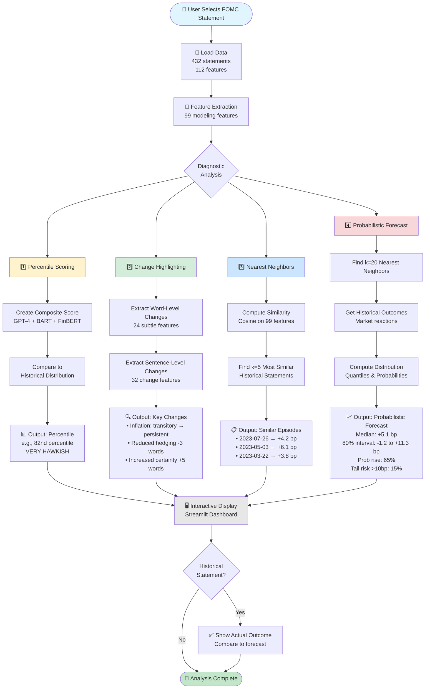
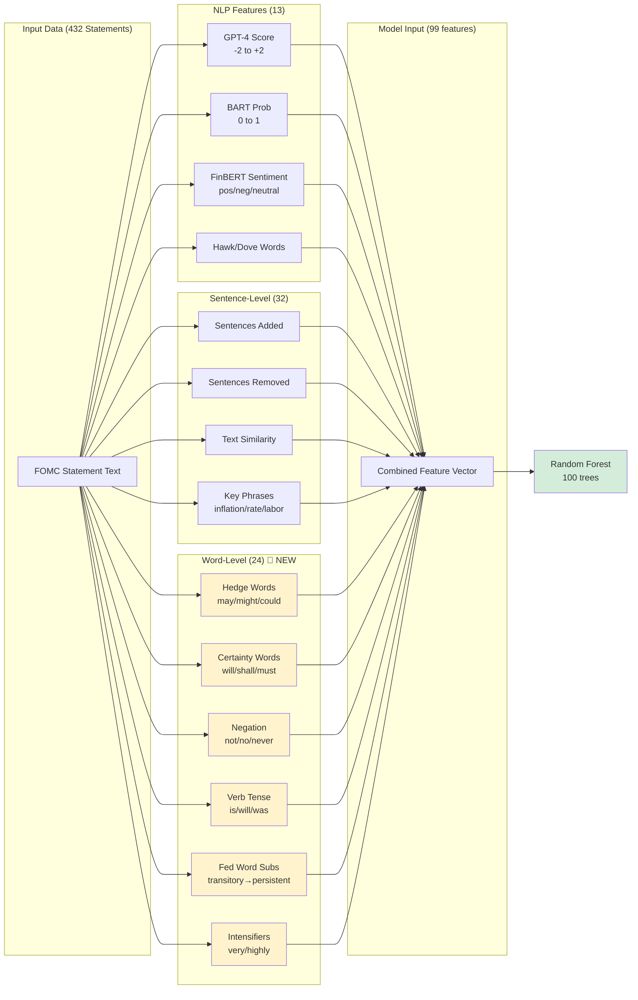
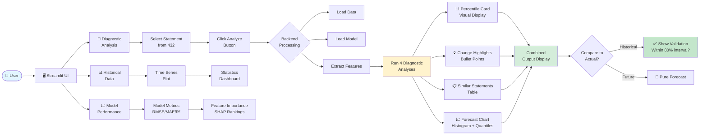
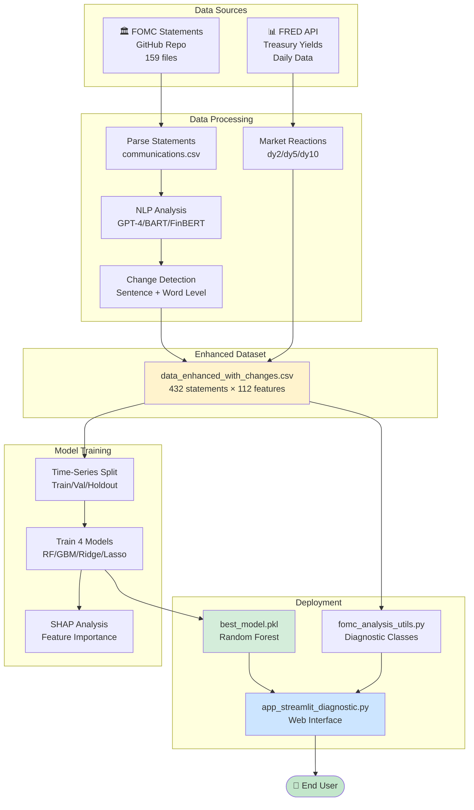

# FOMC Diagnostic Tool - System Flowchart

## Complete System Architecture

```mermaid
graph TD
    Start([🎯 User Selects FOMC Statement]) --> Load[📁 Load Data<br/>432 statements<br/>112 features]

    Load --> Extract[🔧 Feature Extraction<br/>99 modeling features]

    Extract --> Branch{Diagnostic<br/>Analysis}

    Branch --> D1[1️⃣ Percentile Scoring]
    Branch --> D2[2️⃣ Change Highlighting]
    Branch --> D3[3️⃣ Nearest Neighbors]
    Branch --> D4[4️⃣ Probabilistic Forecast]

    %% Percentile Scoring Branch
    D1 --> P1[Create Composite Score<br/>GPT-4 + BART + FinBERT]
    P1 --> P2[Compare to<br/>Historical Distribution]
    P2 --> P3[📊 Output: Percentile<br/>e.g., 82nd percentile<br/>VERY HAWKISH]

    %% Change Highlighting Branch
    D2 --> C1[Extract Word-Level Changes<br/>24 subtle features]
    C1 --> C2[Extract Sentence-Level Changes<br/>32 change features]
    C2 --> C3[🔍 Output: Key Changes<br/>• Inflation: transitory → persistent<br/>• Reduced hedging -3 words<br/>• Increased certainty +5 words]

    %% Nearest Neighbors Branch
    D3 --> N1[Compute Similarity<br/>Cosine on 99 features]
    N1 --> N2[Find k=5 Most Similar<br/>Historical Statements]
    N2 --> N3[📋 Output: Similar Episodes<br/>• 2023-07-26 → +4.2 bp<br/>• 2023-05-03 → +6.1 bp<br/>• 2023-03-22 → +3.8 bp]

    %% Probabilistic Forecast Branch
    D4 --> F1[Find k=20 Nearest Neighbors]
    F1 --> F2[Get Historical Outcomes<br/>Market reactions]
    F2 --> F3[Compute Distribution<br/>Quantiles & Probabilities]
    F3 --> F4[📈 Output: Probabilistic Forecast<br/>Median: +5.1 bp<br/>80% interval: -1.2 to +11.3 bp<br/>Prob rise: 65%<br/>Tail risk >10bp: 15%]

    %% Combine outputs
    P3 --> Display[🖥️ Interactive Display<br/>Streamlit Dashboard]
    C3 --> Display
    N3 --> Display
    F4 --> Display

    Display --> Validate{Historical<br/>Statement?}

    Validate -->|Yes| Actual[✅ Show Actual Outcome<br/>Compare to forecast]
    Validate -->|No| End([🎉 Analysis Complete])

    Actual --> End

    style Start fill:#e1f5ff
    style D1 fill:#fff3cd
    style D2 fill:#d4edda
    style D3 fill:#cce5ff
    style D4 fill:#f8d7da
    style Display fill:#e7e7e7
    style End fill:#c3e6cb
```

## Feature Pipeline Detail

```mermaid
graph LR
    subgraph "Input Data (432 Statements)"
        Raw[FOMC Statement Text]
    end

    subgraph "NLP Features (13)"
        GPT[GPT-4 Score<br/>-2 to +2]
        BART[BART Prob<br/>0 to 1]
        FinBERT[FinBERT Sentiment<br/>pos/neg/neutral]
        Hawk[Hawk/Dove Words]
    end

    subgraph "Sentence-Level (32)"
        SAdd[Sentences Added]
        SRem[Sentences Removed]
        Sim[Text Similarity]
        Phrases[Key Phrases<br/>inflation/rate/labor]
    end

    subgraph "Word-Level (24) 🌟 NEW"
        Hedge[Hedge Words<br/>may/might/could]
        Cert[Certainty Words<br/>will/shall/must]
        Neg[Negation<br/>not/no/never]
        Tense[Verb Tense<br/>is/will/was]
        Subst[Fed Word Subs<br/>transitory→persistent]
        Intens[Intensifiers<br/>very/highly]
    end

    subgraph "Model Input (99 features)"
        Features[Combined Feature Vector]
    end

    Raw --> GPT
    Raw --> BART
    Raw --> FinBERT
    Raw --> Hawk

    Raw --> SAdd
    Raw --> SRem
    Raw --> Sim
    Raw --> Phrases

    Raw --> Hedge
    Raw --> Cert
    Raw --> Neg
    Raw --> Tense
    Raw --> Subst
    Raw --> Intens

    GPT --> Features
    BART --> Features
    FinBERT --> Features
    Hawk --> Features
    SAdd --> Features
    SRem --> Features
    Sim --> Features
    Phrases --> Features
    Hedge --> Features
    Cert --> Features
    Neg --> Features
    Tense --> Features
    Subst --> Features
    Intens --> Features

    Features --> Model[Random Forest<br/>100 trees]

    style Hedge fill:#fff3cd
    style Cert fill:#fff3cd
    style Neg fill:#fff3cd
    style Tense fill:#fff3cd
    style Subst fill:#fff3cd
    style Intens fill:#fff3cd
    style Model fill:#d4edda
```

## Diagnostic Analysis Detail

```mermaid
graph TB
    subgraph "1. Percentile Scoring"
        PS1[Composite Score] --> PS2[Historical Distribution]
        PS2 --> PS3{Percentile}
        PS3 -->|>80%| PSH[🔴 VERY HAWKISH]
        PS3 -->|60-80%| PSM[🟠 Moderately Hawkish]
        PS3 -->|40-60%| PSN[🟡 Neutral]
        PS3 -->|20-40%| PSD[🔵 Moderately Dovish]
        PS3 -->|<20%| PSV[🟢 VERY DOVISH]
    end

    subgraph "2. Change Highlighting"
        CH1[Word Changes] --> CH2[Change Dictionary]
        CH2 --> CH3{Type}
        CH3 -->|Inflation| CHI[transitory → persistent<br/>+2 intensity]
        CH3 -->|Certainty| CHC[+5 certainty words<br/>-3 hedge words]
        CH3 -->|Negation| CHN[Added 'not'<br/>meaning reversal]
        CH3 -->|Tense| CHT[+4 future tense<br/>forward guidance]
    end

    subgraph "3. Nearest Neighbors"
        NN1[Current Features<br/>99-dim vector] --> NN2[Cosine Similarity]
        NN2 --> NN3[All Historical<br/>Statements]
        NN3 --> NN4[Sort by<br/>Similarity]
        NN4 --> NN5[Top k=5<br/>Most Similar]
        NN5 --> NN6[Show Dates +<br/>Actual Reactions]
    end

    subgraph "4. Probabilistic Forecast"
        PF1[Find k=20<br/>Neighbors] --> PF2[Get Market<br/>Outcomes]
        PF2 --> PF3[Compute<br/>Quantiles]
        PF3 --> PF4[10th: -1.2 bp<br/>50th: +5.1 bp<br/>90th: +11.3 bp]
        PF2 --> PF5[Compute<br/>Probabilities]
        PF5 --> PF6[Prob rise: 65%<br/>Prob fall: 35%<br/>Tail >10bp: 15%]
    end

    style PSH fill:#ffcccc
    style PSM fill:#ffe6cc
    style PSN fill:#ffffcc
    style PSD fill:#cce6ff
    style PSV fill:#ccffcc
```

## Streamlit App Flow

```mermaid
graph LR
    User([👤 User]) --> UI[🖥️ Streamlit UI]

    UI --> Tab1[🔬 Diagnostic<br/>Analysis]
    UI --> Tab2[📊 Historical<br/>Data]
    UI --> Tab3[📈 Model<br/>Performance]

    Tab1 --> Select[Select Statement<br/>from 432]
    Select --> Analyze[Click Analyze<br/>Button]

    Analyze --> Backend{Backend<br/>Processing}

    Backend --> Load1[Load Data]
    Backend --> Load2[Load Model]
    Backend --> Load3[Extract Features]

    Load3 --> Diag[Run 4 Diagnostic<br/>Analyses]

    Diag --> Viz1[📊 Percentile Card<br/>Visual Display]
    Diag --> Viz2[💡 Change Highlights<br/>Bullet Points]
    Diag --> Viz3[📋 Similar Statements<br/>Table]
    Diag --> Viz4[📈 Forecast Chart<br/>Histogram + Quantiles]

    Viz1 --> Output[Combined<br/>Output Display]
    Viz2 --> Output
    Viz3 --> Output
    Viz4 --> Output

    Output --> Compare{Compare to<br/>Actual?}

    Compare -->|Historical| Actual[✅ Show Validation<br/>Within 80% interval?]
    Compare -->|Future| Predict[🔮 Pure Forecast]

    Tab2 --> TS[Time Series<br/>Plot]
    TS --> Stats[Statistics<br/>Dashboard]

    Tab3 --> Perf[Model Metrics<br/>RMSE/MAE/R²]
    Perf --> Feat[Feature Importance<br/>SHAP Rankings]

    style User fill:#e1f5ff
    style Diag fill:#fff3cd
    style Output fill:#d4edda
    style Actual fill:#c3e6cb
```

## Data Flow Architecture

```mermaid
graph TD
    subgraph "Data Sources"
        FOMC[🏛️ FOMC Statements<br/>GitHub Repo<br/>159 files]
        FRED[📊 FRED API<br/>Treasury Yields<br/>Daily Data]
    end

    subgraph "Data Processing"
        Parse[Parse Statements<br/>communications.csv]
        NLP[NLP Analysis<br/>GPT-4/BART/FinBERT]
        Changes[Change Detection<br/>Sentence + Word Level]
        Market[Market Reactions<br/>dy2/dy5/dy10]
    end

    subgraph "Enhanced Dataset"
        CSV[data_enhanced_with_changes.csv<br/>432 statements × 112 features]
    end

    subgraph "Model Training"
        Split[Time-Series Split<br/>Train/Val/Holdout]
        Train[Train 4 Models<br/>RF/GBM/Ridge/Lasso]
        SHAP[SHAP Analysis<br/>Feature Importance]
    end

    subgraph "Deployment"
        Model[best_model.pkl<br/>Random Forest]
        Utils[fomc_analysis_utils.py<br/>Diagnostic Classes]
        App[app_streamlit_diagnostic.py<br/>Web Interface]
    end

    FOMC --> Parse
    Parse --> NLP
    NLP --> Changes
    FRED --> Market

    Changes --> CSV
    Market --> CSV

    CSV --> Split
    Split --> Train
    Train --> SHAP

    Train --> Model
    CSV --> Utils
    Model --> App
    Utils --> App

    App --> User([👤 End User])

    style CSV fill:#fff3cd
    style Model fill:#d4edda
    style App fill:#cce5ff
    style User fill:#c3e6cb
```

